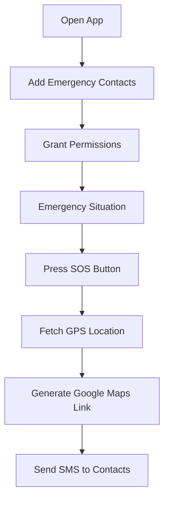

<!-- ===================================================== -->
<!-- ===================== ATHENA ======================== -->
<!-- ===================================================== -->

<h1 align="center">🛡️ ATHENA</h1>
<h3 align="center">Women Safety Android Application</h3>

<p align="center">
  <b>Empowering Safety • Enabling Strength • One Tap Protection</b>
</p>

<p align="center">
  
  
  
  
  
</p>

<p align="center">
  
</p>

---

# 🌸 About The Project

**ATHENA** is a smart and reliable Android-based Women Safety Application developed using **Java**.  

It is designed to provide instant emergency support by allowing users to:

- 🚨 Trigger SOS alerts instantly  
- 📍 Share real-time GPS location  
- 📩 Send automatic emergency SMS  
- 👥 Notify trusted contacts immediately  

In critical moments, every second matters.  
Athena ensures that help is just **one tap away**.

---

# ✨ Core Features

## 🚨 1. One-Tap SOS Alert
With a single tap:
- Fetches current location
- Generates Google Maps link
- Sends emergency SMS to all saved contacts

---

## 📍 2. Real-Time Location Sharing

Emergency message example:

```
I am in danger. Please help me immediately.
My Location:
https://maps.google.com/?q=latitude,longitude
```

Location is fetched using:
- Android Location Services (GPS Provider)

---

## 👥 3. Emergency Contact Management

- Add multiple trusted contacts  
- Update or delete contacts  
- Stored securely in local storage  

---

## 📲 4. Automatic SMS Service

- Uses Android `SmsManager`
- Sends predefined emergency alert
- Works even without internet (SMS-based system)

---

## 🔐 5. Secure Permission Handling

Required permissions:

- `ACCESS_FINE_LOCATION`
- `SEND_SMS`
- `READ_CONTACTS`

User privacy and minimal permissions ensured.


# 🧠 How It Works



---

# 🏗️ Project Architecture

```
Athena/
│
├── app/
│   ├── java/
│   │   ├── MainActivity.java
│   │   ├── ContactsActivity.java
│   │   ├── LocationHelper.java
│   │   ├── SMSHelper.java
│   │
│   ├── res/
│   │   ├── layout/
│   │   ├── drawable/
│   │   └── values/
│   │
│   └── AndroidManifest.xml
│
└── build.gradle
```

---

# 🛠️ Tech Stack

| Layer | Technology Used |
|-------|-----------------|
| Language | Java |
| Platform | Android |
| IDE | Android Studio |
| Location API | Android GPS Provider |
| Messaging | SmsManager API |
| Build System | Gradle |

---

# 🚀 Installation & Setup

## 1️⃣ Clone Repository

```bash
git clone https://github.com/Umeshhakke/Athena.git
```

## 2️⃣ Open in Android Studio

- Open Android Studio
- Click **Open**
- Select Athena folder
- Wait for Gradle sync

## 3️⃣ Run Application

- Connect Android device / Emulator
- Click ▶ Run

---

---

# 📲 Download Application

<p align="center">
  <a href="https://drive.google.com/file/d/1HkPezj9_FjbHN0xBmXT6Li9iZJrsvJQ8/view?usp=drivesdk" target="_blank">
    
  </a>
</p>

👉 **Download the APK:**  
https://drive.google.com/file/d/1HkPezj9_FjbHN0xBmXT6Li9iZJrsvJQ8/view?usp=drivesdk

---


# 🔒 AndroidManifest Permissions

```xml
<uses-permission android:name="android.permission.ACCESS_FINE_LOCATION"/>
<uses-permission android:name="android.permission.SEND_SMS"/>
<uses-permission android:name="android.permission.READ_CONTACTS"/>
```

---

# 🎯 Future Enhancements

- 🎤 Voice-Activated SOS Trigger
- 📳 Shake Detection for Emergency
- ☁️ Firebase Cloud Backup
- 🗺️ Nearby Police Station Finder
- 📡 Continuous Live Tracking Mode
- 🔔 Emergency Alarm Sound

---

# 📊 Vision & Impact

ATHENA is not just a mobile app —  
it is a technological step toward women empowerment and digital safety innovation.

By reducing emergency response time and enabling immediate communication, Athena contributes toward:

- Improved personal security  
- Faster emergency response  
- Peace of mind for users and families  

---

# 🤝 Contributing

Contributions are welcome!

```bash
1. Fork the repository
2. Create new branch (feature-name)
3. Commit changes
4. Push branch
5. Open Pull Request
```

---

# 📜 License

This project is licensed under the MIT License.

---

# 👨‍💻 Developed By

<h3 align="center">Umesh Pandit Hakke</h3>

<p align="center">
  Android Developer • AI Enthusiast • Security Focused
</p>

---

<p align="center">
  ⭐ If you like this project, consider giving it a star!
</p>

<!-- ===================================================== -->
<!-- ================== END OF README ==================== -->
<!-- ===================================================== -->
